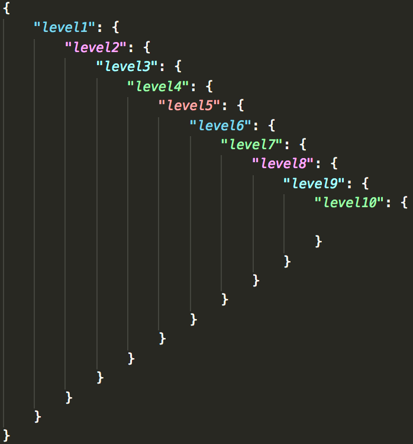

# VSC - JSON - Coloriser

Adds Sublime / Atom like color indentation for JSON files up to 10 levels

## Install

Add this to the bottom of your VSC settings.json file (without the containing object). This is setup to use Monokai theme, replace with your choice!

## Example

